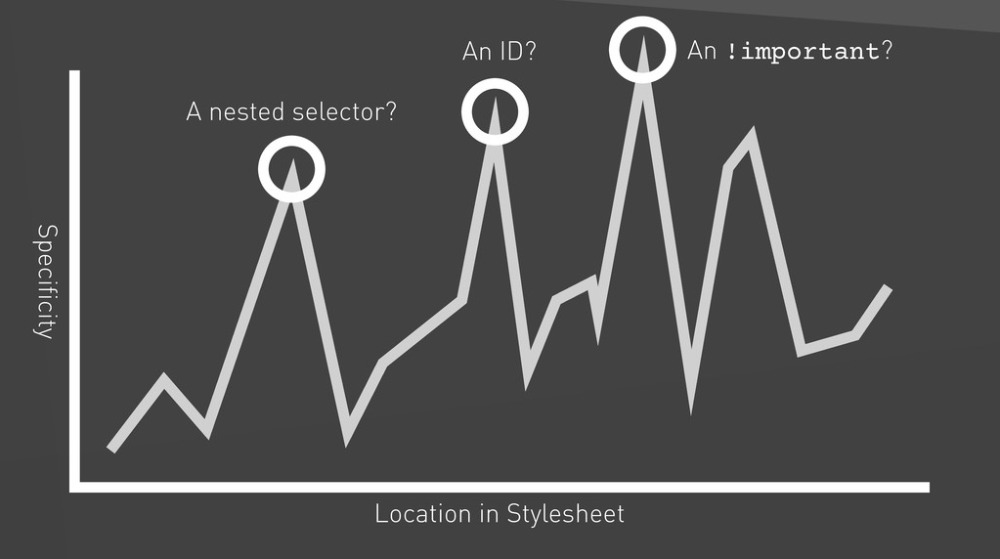
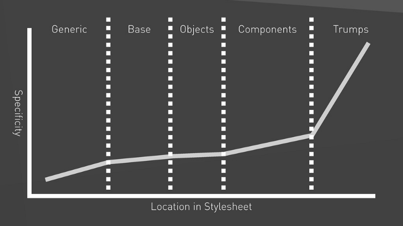
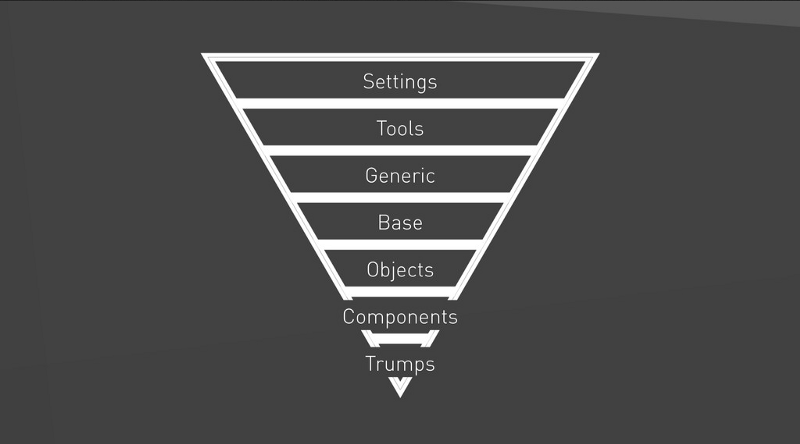

Everyone knows how CSS can be painful when not written properly. It is not an expressive language, it has a global scope, cascading rules (the source order really matters), inheritance, and selector specificity wars. The way CSS works makes it easy for bad code to take over. It is possible to use nested selectors to override existing rules, use __!important__ to quickly solve a styling problem, write CSS to undo other CSS, and so on.

> If you want to know more about how CSS works, [read this](https://developer.mozilla.org/en-US/docs/Learn/CSS/Introduction_to_CSS/Cascade_and_inheritance).



These issues are especially recurring on large projects with lots of developers involved. If we do not understand their impact, our tendency goes toward generating a giant snow ball that nobody wants to touch or refactor.

But how to solve these issues elegantly, be it in large or smaller projects, and using our tools to our advantage? The answer is _by writing CSS in specificity order_, and that’s where ITCSS comes to help!

## ITCSS (Inverted Triangle CSS)

ITCSS is an architecture especially suited for large code bases created by [Harry Roberts](https://csswizardry.com/) for large CSS code bases, It is neither a library nor a framework, but a way of thinking. Moreover, it doesn’t really depend on pre-processors such as SASS or LESS. Which means we can apply it with either pure CSS or any pre-processor of our liking. We can also glean the benefits of ITCSS on smaller code bases.

It consists in organizing CSS files within layers, from generic to explicit, and from low to high specificity. These layers tame the source order and manage cascading stylesheets in a more sane way.



Layers, in turn, are composed of __sections__, each defining a particular specificity and meaning. This is ITCSS’ way to gracefully deal with specificity wars: there is no redundancy, and specificity grows linearly.

With that being said, every concept has a determined place to live in, and this is one of the things I like the most about ITCSS. When all sections are well-defined and perfectly understood, it becomes obvious where to put new files or how to look up for existing code, thus avoiding questions like:

- "Where do I put this style? Should I create a new file or just put it into an existing one?"
- "Where did I put that class I wrote last week?"

Now, let’s go over each of these sections.

### Settings

_Settings_ refer to all your global configurations and variables, like _sizes_, _colors_, and _fonts_. They should be used to aid in your build configuration, and therefore should not contain actual CSS code. Example:

```scss
$color-ui: #bada55;
$spacing-unit: 10px;
```

### Tools

If you use a pre-processor in your _build_ setup, this is the place where _mixins_ and _functions_ ought to live. For example: _mixins_ for media queries, font-faces, animations, etc.

```scss
@mixin font-brand() {
  font-family: "UI Font", sans-serif;
  font-weight: 400;
}
```

If you do not use a pre-processor, you can safely ignore these first two layers.

### Generic

HHere you should have low-specificity styles which are meant to be applied all over the DOM. These include _box-sizing_, _resets_, _normalize_, etc.

This is the first layer where we can use pure CSS.

```scss
*,
*::before,
*::after {
  box-sizing: border-box;
}
```

Personally, I enjoy having in this section styles such as [text selection](https://github.com/iagodahlem/iagodahlem.github.io/blob/master/_sass/generic/_selection.scss), [font-smoothing](https://github.com/iagodahlem/iagodahlem.github.io/blob/master/_sass/generic/_font-smoothing.scss) and [tap-highlight reset](https://github.com/iagodahlem/iagodahlem.github.io/blob/master/_sass/generic/_tap-highlight.scss).

### Elements

_Elements_ refer to all _unclassed_ HTML tags. Styles in here get applied to specific HTML tags, like _headings_, _links_, and _lists_. This is the last layer where we use type selectors.

```scss
ul {
  list-style: square outside;
}
```

Although this layer is sometimes called _"base"_, I prefer to name it _elements_, due to it being a more readable name.

### Objects

_Objects_ follow [OOCSS](http://oocss.org/) (Object Oriented CSS) principles. They are small and reusable pieces with no aesthetics which can be used in UI composition. Examples are _wrappers_, _grids_, _skins_ to apply to _lists_, _buttons_, _inputs_, etc. In other words: any pattern that is repeated over your UI is a potential _object_ candidate. What ITCSS author said applies to this layer: No cosmetics. Agnostically named (e.g. .ui-list).

Here we start using just CSS classes:

```scss
.ui-list {
  margin: 0;
  padding: 0;
  list-style: none;
}

.ui-list__item {
  padding: $spacing-unit;
}
```

I find _objects_ to be the most confusing layer due to it mixing _objects_ and _components_. If you do not use OOCSS or find it confusing, just skip this layer. I personally prefer to skip it entirely to avoid confused mental mapping. That avoids me to stop and think: _“Is that an object or a component?"_, and to remain focused on the real problem.

This is yet another nice aspect of ITCSS: you can change and adapt anything to your specific needs.

### Components

In this layer, like the author said, you should have well-designed pieces of UI that can be reused in more than one spot (or be applied to just one spot). Also, classes must be named explicitly:

```scss
.products-list {
  @include font-brand();
  border-top: 1px solid $color-ui;
}

.products-list__item {
  border-bottom: 1px solid $color-ui;
}
```

So, there’s a basic difference between _objects_ and _components_. The former refers to generic, abstract pieces of UI with no aesthetic, whereas the latter is a more specific layer targeted at reusability and well-defined aesthetics.

If you choose not to use the _objects_ layer, you can use components to handle _all small, independent, generic, and reusable pieces of your UI_, like `.button`, `.input`, etc.

If you need to style _even more specific_ parts of your UI, you can add a new layer called _pages_ or _layout_, depending on the specificity of your styles and the pattern adopted by your team.

### Trumps

Here you can have _overrides_, _helpers_, _utilities_, and specific classes that affect single pieces of the DOM, like, `.hidden`, `.relative`, `.one-half`, etc.

Because we need to override settings coming from other layers, this is the __only__ place where `!important` is permitted.

```scss
.one-half {
  width: 50% !important;
}
```

However, be careful and don’t let this layer grow out of bounds! Try to add coherent classes to it, and avoid overriding styles with `!important` just for the sake of it.



### Extra

Because ITCSS is very adaptable and customizable, you can add and remove layers as you wish or need to scale. For example, you can add a _theme_ layer between components and trumps if you need specific theming.

## Concluding

With ITCSS, specificity slowly increases and can be customized according to specific needs. Therefore, it allows your CSS to scale much more easily. If you found this idea attractive and want to stick to it, I recommend you define a concise pattern with your team and be rigid with it. Benefits are that you will finally have all of your code in predictable spots, thus bumping up everyone’s productivity!

## References

This post was based on [Harry Roberts presentation](https://speakerdeck.com/dafed/managing-css-projects-with-itcss),  with my own thoughts added. Take a look at it if you want to go a little further.

Thank you.
